# NZIHL / NZWIHL Broadcast Assets — Inventory

A plain-language guide to everything that's been built for the NZIHL and NZWIHL broadcasts: the on-air graphics, the live overlays, the websites, and the data that quietly feeds all of it. Every entry below shows a real, current capture of the actual thing — not a mockup.

Everything lives across a small family of GitHub repositories (all under `matchavez/`) and is published live at **matchavez.com**. The **[Hockey Portal](https://matchavez.com/hockey/)** is the front door to almost all of it — if in doubt, start there.

---

## 1. On-air graphics (still images, generated automatically)

These are ready-made pictures — PNGs — that get pulled straight into the broadcast software (OBS/vMix/YoloBox). Most of them regenerate themselves overnight or on request, so nobody has to rebuild them by hand each week.

### Standings Graphic

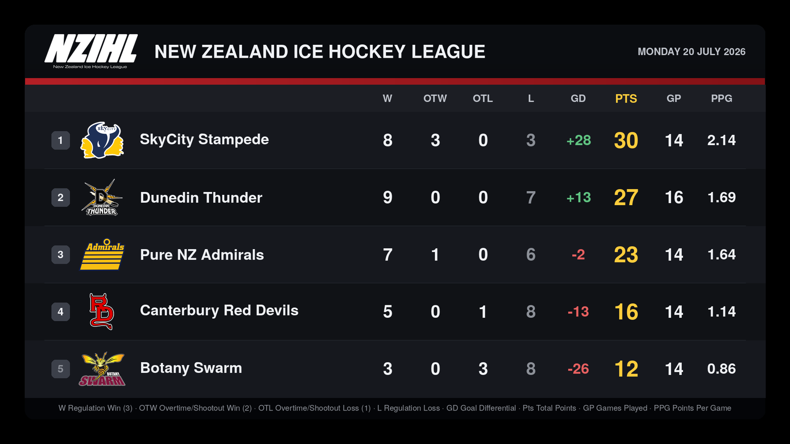

The league table, redrawn fresh every night. It shows every team's wins, overtime wins/losses, losses, goal difference and points, sorted the way the league actually ranks teams. A scheduled script checks the official league website every night at 2am, reads the current standings off it, and draws a new image — so the graphic is always accurate without Mat manually rebuilding it in Keynote like before. If the league site is briefly unreachable, it quietly falls back to the last good numbers rather than publishing something broken.

**Data comes from:** the official NZIHL/NZWIHL websites' standings pages.
**Lives at:** `matchavez/nzihl-broadcast-assets` — hotlinked directly into broadcast software from `NZIHL_Standings.png` / `NZWIHL_Standings.png`.

### 2026 Season Schedule Graphic

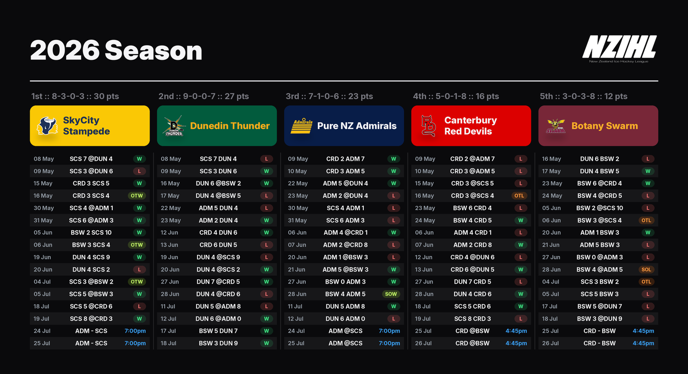

A single-image season planner: the top 5 seeded teams in the league, each with their full 16-game schedule (played results and upcoming games) stacked underneath. Built from the same season data as the Standings graphic, so results always match what's shown elsewhere — this capture was generated fresh just now and reflects the actual current table.

**Data comes from:** the season data warehouse (see section 4).
**Lives at:** `matchavez/nzihl-broadcast-assets` (`Graphics/2026 Season/`).

### Playoff Scenarios Graphic

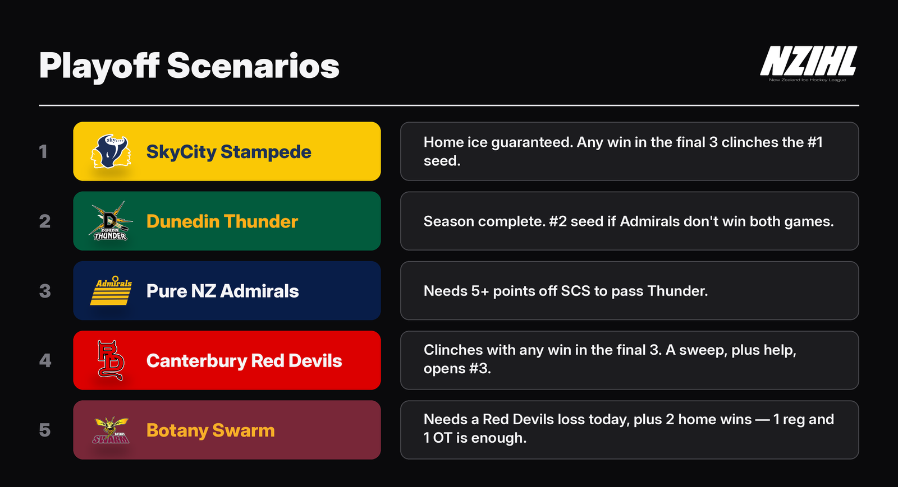

A one-off "what needs to happen" graphic worked through by hand once the playoff race tightened — every mathematically possible way the remaining games could shuffle the final seeding, laid out per team. This is a snapshot from when it was built — it goes stale the moment a game is played and would need re-running against fresh results if reused.

**Lives at:** project folder `Graphics/Playoff Scenarios/`.

### Keys to the Series

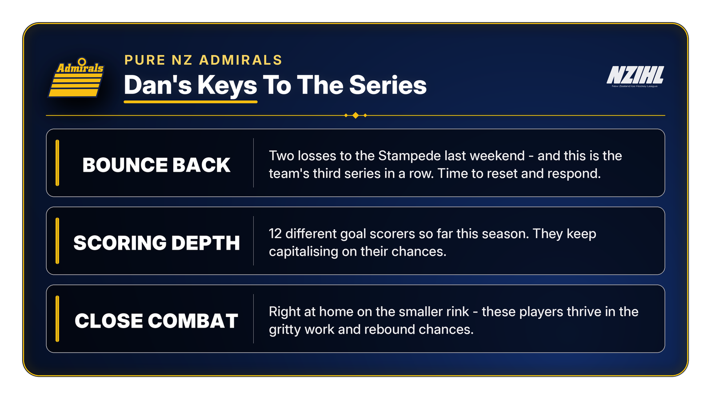

"Dan's Keys to the Series" — a polished, team-branded still with three (or four) talking points for an upcoming series, styled with each team's own colours and logo. Dan writes the keys; this turns them into a broadcast-ready graphic in the team's own look. It's a reusable template — feed in a new team name and set of keys, and it generates the next one.

**Lives at:** project folder `Graphics/Keys to the Series Template/` (generated on request per matchup).

### Up Next Overlay

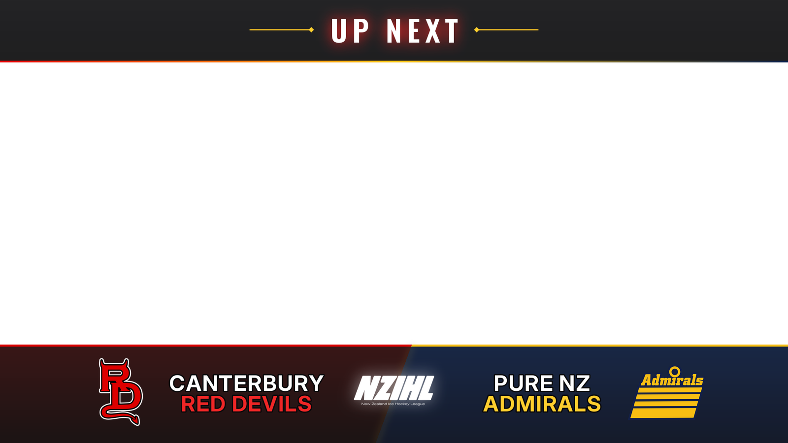

The animated "coming up next" graphic that plays over the stream-starting-soon countdown, showing the two teams about to play. Every possible matchup, both leagues, has already been pre-built (over 120 combinations) so there's no last-minute rendering before a broadcast — just grab the right file.

**Lives at:** `matchavez/nzihl-broadcast-assets` (`up-next/` — one folder per team, each with a one-click zip download); also linked from the Hockey Portal.

### DVD Bounce Loops

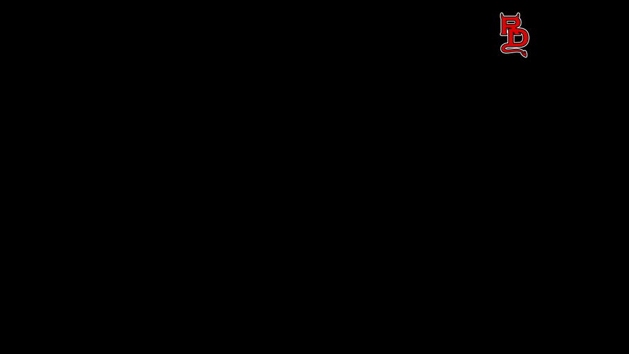

The nostalgic "DVD screensaver" bouncing-logo animation, built per team, for use in broadcast breaks. Each team's logo drifts and bounces around a black screen at a natural, varied pace and loops seamlessly forever with no visible jump. Every team has four versions (one for each starting corner).

**Lives at:** `matchavez/nzihl-broadcast-assets` (`DVD Bounce Loops/`); also linked from the Hockey Portal.

### CIHA Under-12 Lower Third

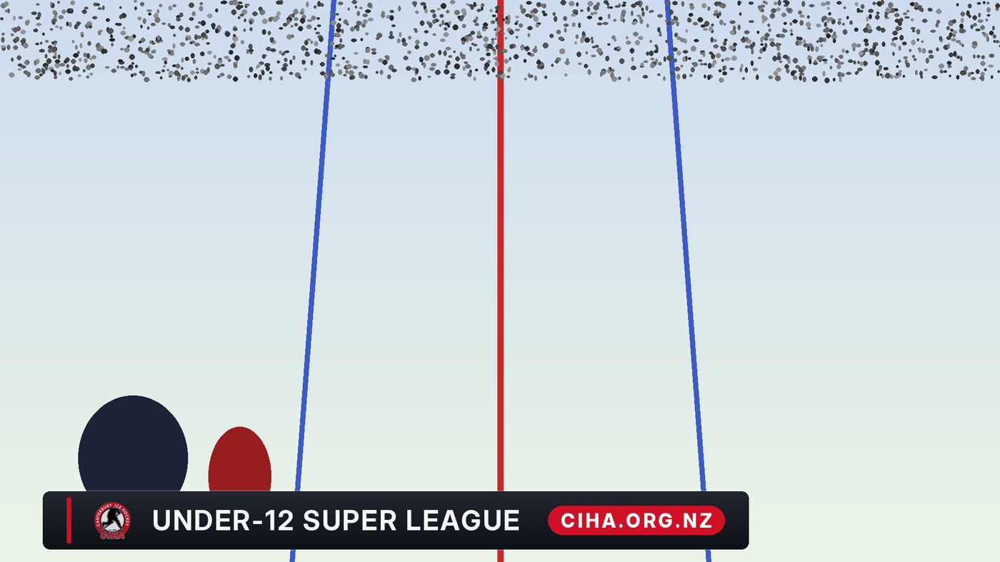

A simple branded banner for the Canterbury Ice Hockey Association's Under-12 Super League exhibition games shown during NZIHL intermissions — team badge, competition name, and the CIHA website address in a clean red pill.

**Lives at:** project folder `Graphics/CIHA Under-12 Lower Third/`.

---

## 2. Live on-screen overlays (update themselves during the game)

These aren't static pictures — they're small web pages that broadcast software treats as a "browser source." Once added to OBS/vMix/YoloBox, they check the league's live box score every few seconds on their own and update themselves in real time — no one needs to type anything in during the game. Every capture below is the real, current page, live off tonight's actual data.

### Scorebug + Live Banner *(Red Devils)*

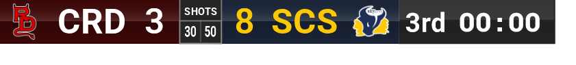

The Red Devils' live scoreboard, showing the real score from their most recent game as this was captured. An automatic banner (below) pops up across the top whenever a goal or penalty happens.

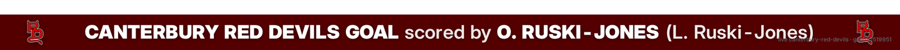

The goal/penalty banner in action — team colours, player name, and the details, styled to match the broadcast. It watches the live box score feed and reacts within seconds of a real update. (This example was triggered through the page's own test button, using real player names from the test data — the banner itself renders exactly as it would live.)

**Live at:** `matchavez.com/hockey/scorebug/` (superseded for most broadcasts by Scorebug + Player L3s below, which does everything this does plus player features).

### Activity Banner

The same automatic goal/penalty banner shown above, but built as its own transparent layer with no scoreboard baked in — so it can sit over whatever scoreboard system a venue is already running. Works for every team except Auckland Mako (who aren't playing games this season).

**Live at:** `matchavez.com/hockey/activity-banner/?team=<team>`.

### Scorebug + Player L3s

A combined scoreboard-and-banner page (visually identical to the Scorebug above) that also supports Player Lower Thirds — see below. This is the current recommended single source for any team needing both a scoreboard and goal/penalty/player banners in one browser source.

**Live at:** `matchavez.com/hockey/scorebug-l3/?team=<team>`.

### Player Lower Thirds

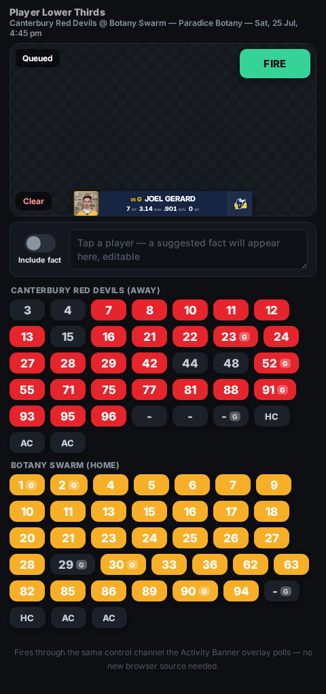

A phone-friendly control page a producer can use courtside to put a specific player's name, photo, and season stats up on screen with one tap — for example, to introduce a goal scorer or highlight a standout performance. A short computed "why this player is interesting right now" line (an active points streak, a milestone, a head-to-head record) is generated automatically rather than being typed in. Tapping a jersey number on the phone makes the player appear on the broadcast within a second or two via a small always-on relay in the background.

**Live at:** phone control page `matchavez.com/hockey/lowerthirds/?team=<team>` (password-protected); appears on-screen through the Activity Banner / Scorebug + L3 pages above.

### Ticker Page

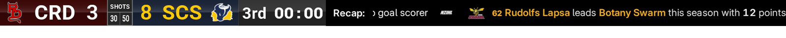

A scoreboard plus a continuously scrolling news-ticker along the top, narrating the game in full sentences as it happens — "Recap: [scorer] leads Botany Swarm this season with 12 points" — rather than just numbers. It tracks the running score, calls out milestones, lead changes, period breaks, and even pulls in season context like league scoring rank and the last time these two teams played.

**Live at:** `matchavez.com/hockey/ticker/?team=<team>`.

### Live Game Summary

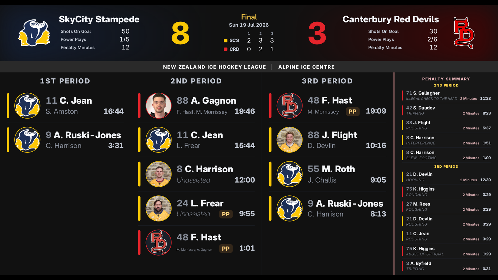

A full digital box score for the broadcast — team logos, running score, period-by-period scoring with player photos next to each goal, shots/power-plays/penalty minutes, and a penalties column — replacing the old page that used to scroll awkwardly mid-broadcast. This capture shows a completed game rendered exactly as it would appear live.

**Live at:** `matchavez.com/hockey/summary/?team=<team>`.

### Team Scoring Leaders

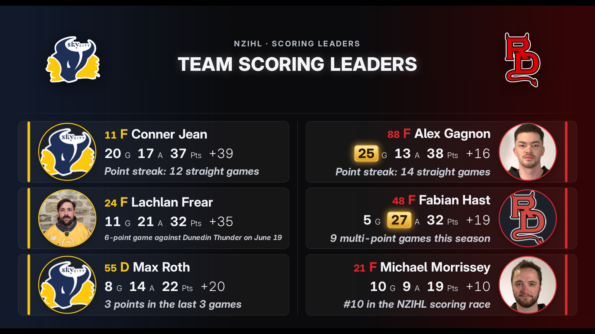

Shows each team's current top-3 point scorers head-to-head — photo, name, stats, and a short computed note about why they're worth watching (a hot streak, a league ranking, their share of the team's scoring). Still being actively fine-tuned round to round.

**Live at:** `matchavez.com/hockey/scoringleaders/?team=<team>`.

### Starting Lineup

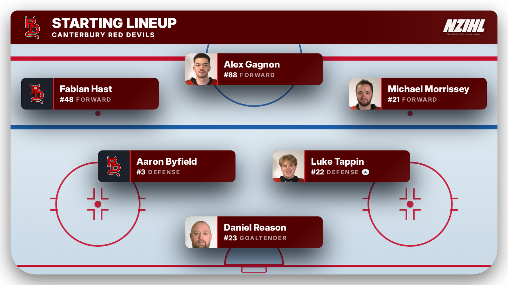

An evergreen "tonight's starting six" graphic for each team — forwards, defence and goalie on a simple rink diagram with player photos, numbers and positions. A director's control page lets someone set or change the lineup any time (lineups barely change game to game, so it just stays as last set).

**Live at:** `matchavez.com/hockey/startinglineup/?team=<team>` (control page at `.../startinglineup/control/?team=<team>`).

### Combined Starting Lineups

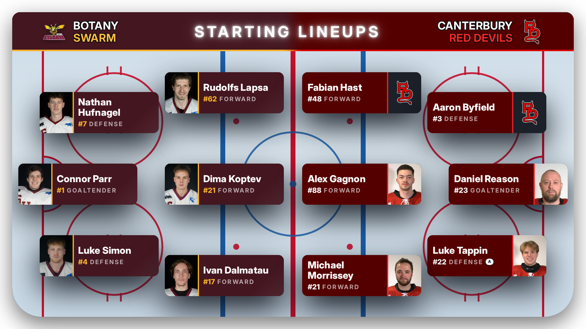

The same idea as above, but shows **both** teams' lineups on one rink at once for a head-to-head look ahead of the game.

**Live at:** `matchavez.com/hockey/startinglineup/combined/?home=<team>&away=<team>` (or `?team=<team>` for an evergreen version that follows that team's next game).

---

## 3. Websites & producer tools

### Hockey Portal

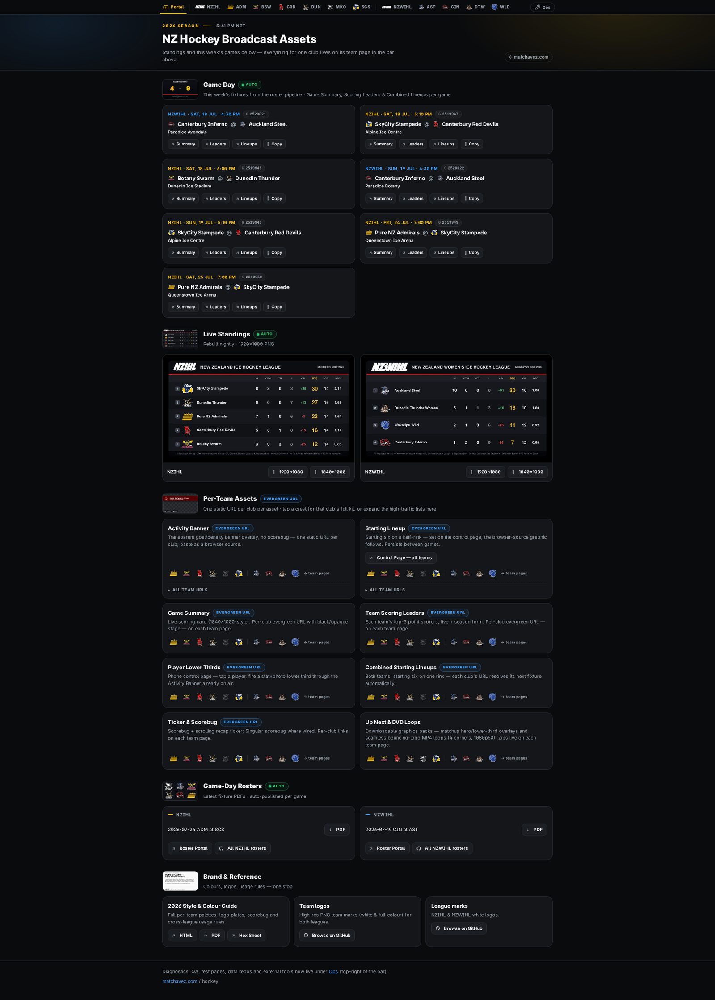

The home base — one page linking every asset above, plus live standings, this weekend's games, downloadable rosters, brand assets and more. If a producer needs to find or copy anything, this is where they'd start.

**Live at:** `matchavez.com/hockey/`.

### Team Pages

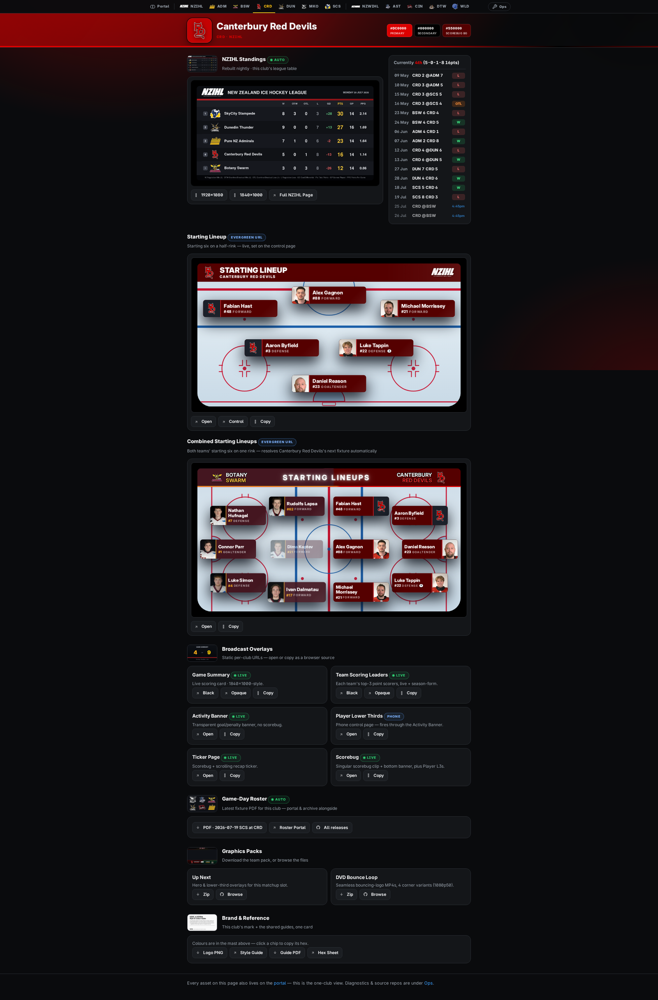

A dedicated page per club (all 10, both leagues) showing that team's branding, standings position, schedule/results, and every overlay/graphic that applies to them in one place — a one-stop reference for "everything about the Red Devils" without hunting through the whole Portal.

**Live at:** `matchavez.com/hockey/team/?team=<team>`.

### League Pages

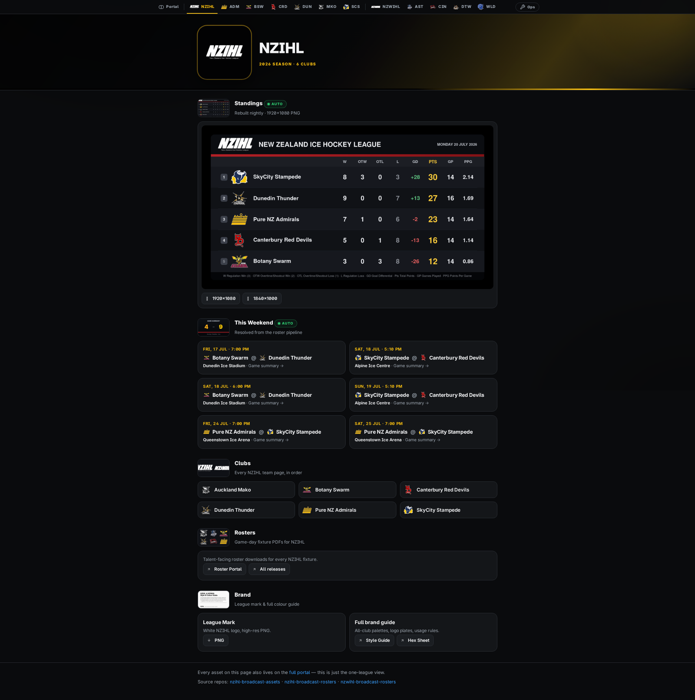

The same idea scoped to a whole league instead of one club: standings, this weekend's fixtures, a clubs directory, roster links, and brand.

**Live at:** `matchavez.com/hockey/league/?league=nzihl` (or `nzwihl`).

### Game Data & Photo Warehouse

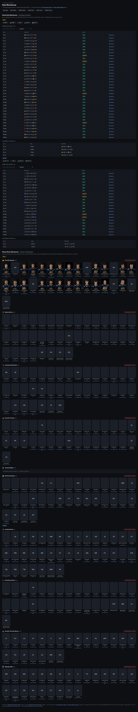

A single reference page combining two things: a searchable table of every completed and upcoming game this season (with current streaks), and a browsable photo gallery of every rostered player and coach with their season stats. Built so producers have one place to look up "what's this team's form like" or "what does this player look like" without digging through the league website.

**Live at:** `matchavez.com/hockey/warehouse/`.

### Roster PDFs (talent-facing)

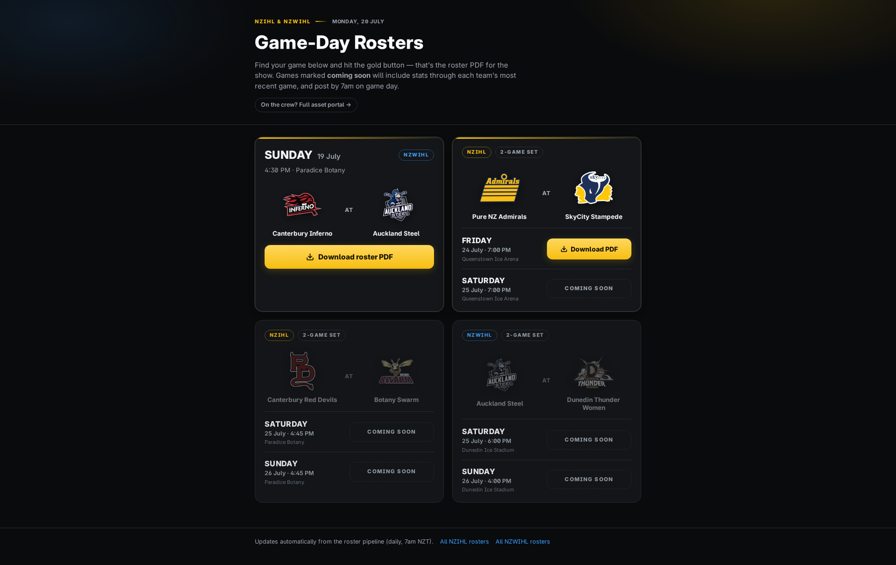

A simple downloads page for broadcast talent — one card per upcoming game with both teams' logos, and a "Download roster PDF" button. Rosters are generated automatically the morning of each broadcast window and published here as soon as they're ready; games without a roster yet show a "Coming Soon" placeholder instead of a broken link.

**Live at:** `matchavez.com/hockeyrosters/`.

### Style Guide & Brand Reference

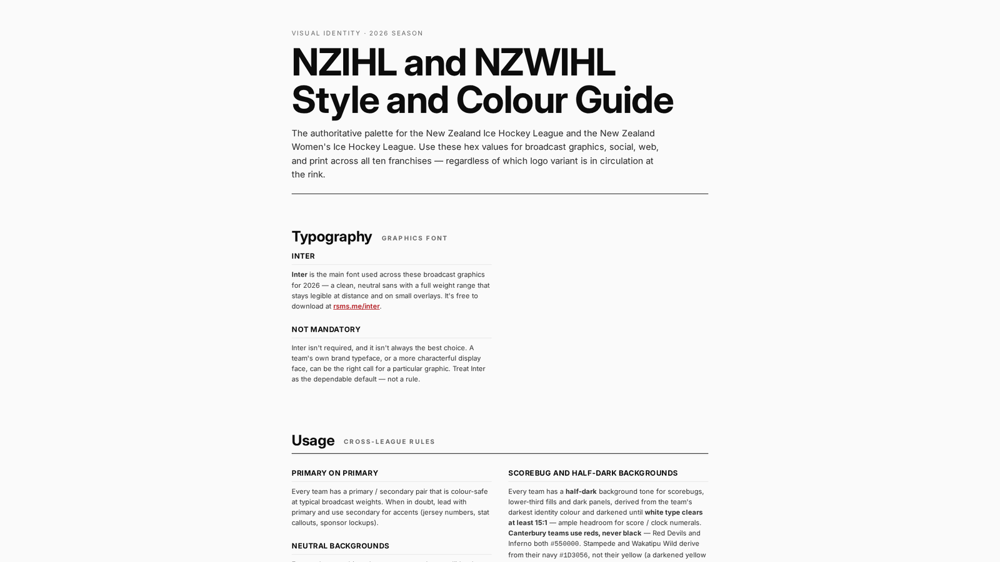

The single source of truth for every team's official colours, logo files, and typography — used to keep every graphic across every asset consistent. Includes a companion "hex cheat sheet" for quickly grabbing exact colour codes.

**Lives at:** project folder `Style Guide/` (HTML + PDF versions), also linked from the Hockey Portal.

### Pre-Flight

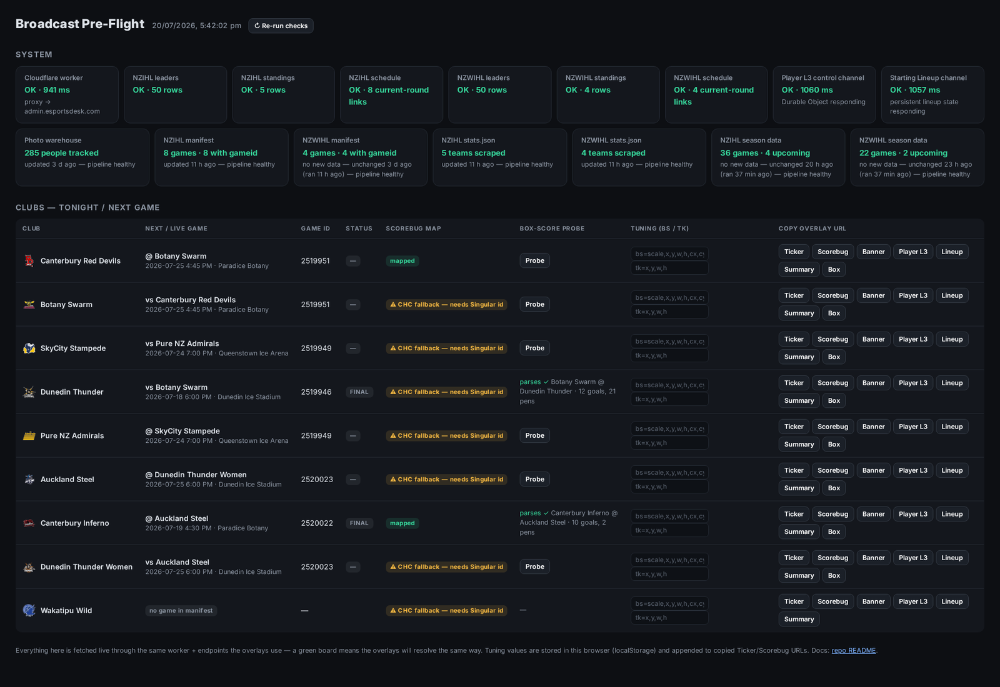

A producer's health-check dashboard for game day — at a glance, it shows whether the live data feed is working, whether each team's schedule data is fresh, which teams' scoreboards are correctly wired up, and gives one-click "copy the right URL" buttons for every overlay. Built after data staleness caused a real problem once — this page exists so that gets caught before air, not during. This capture is today's actual live status board.

**Live at:** `matchavez.com/hockey/preflight/`.

### Graphics QA

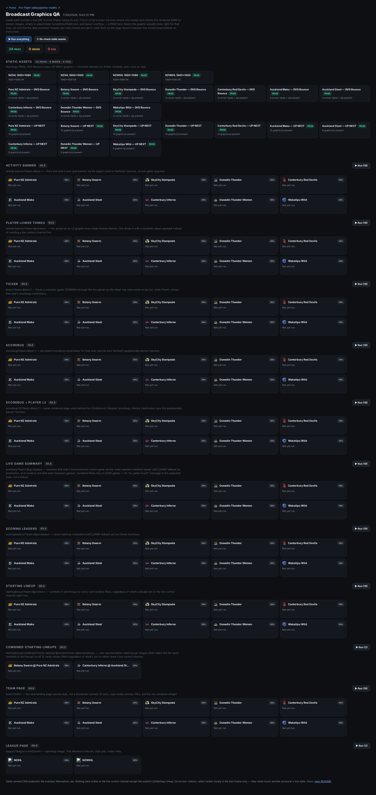

A companion testing dashboard that actually loads each live overlay for every club and checks it's rendering correctly (not just that the data behind it is fine) — catching things like broken images or garbled text before a broadcast, not during one.

**Live at:** `matchavez.com/hockey/graphicstests/`.

---

## 4. Behind-the-scenes data (not visual, but everything above depends on it)

These don't appear on screen themselves — they're the automatic data-gathering that keeps everything above accurate without manual updates.

- **Season Data Warehouse** (`matchavez/nzihl-season-data`) — a nightly scrape that saves every completed game into a permanent record, plus computed extras like win/loss streaks, head-to-head history between any two teams, and per-player game logs. This is what lets the Ticker mention "these two teams last played on..." or "Team X leads the season series."
- **Roster & Schedule Pipeline** (`matchavez/nzihl-broadcast-rosters`, `matchavez/nzwihl-broadcast-rosters`) — the daily automatic job that builds the roster PDFs (shown on the Roster PDFs page above) and keeps a short-term schedule file up to date for the upcoming games.
- **Player Photo Warehouse** (`matchavez/nzihl-player-photos`) — a weekly automatic scrape that saves a permanent, versioned copy of every player's and coach's headshot (visible throughout the Game Summary, Player Lower Thirds, and Warehouse pages above), so broadcast graphics have a reliable photo to pull from instead of depending on the league website being up during a live show.

---

## 5. Broadcast quality & hardware

Not digital assets, but investigative work done to improve the actual broadcast picture — no on-screen graphic to capture here, just research and test procedures:

- **Camera selection** — research and buying criteria for the main broadcast camera (autofocus reliability was the top priority, since it's operated by a non-professional).
- **Signal quality testing kit** — a reusable test video and measurement method for diagnosing softness/quality issues anywhere in the broadcast chain (camera → encoder → stream).
- **Framerate/cadence investigation** — diagnosed and resolved an earlier issue where the stream looked "jumpy" due to a frame-rate mismatch in the broadcast chain.

---

*Every screenshot above was captured live off matchavez.com on 20 July 2026, using real data from that day (scores, players, and standings shown are genuine, not placeholders). Several of the live overlays are still being actively fine-tuned round to round (Team Scoring Leaders, Starting Lineups, and Player Lower Thirds in particular) — small visual details may have moved on since this was captured.*
