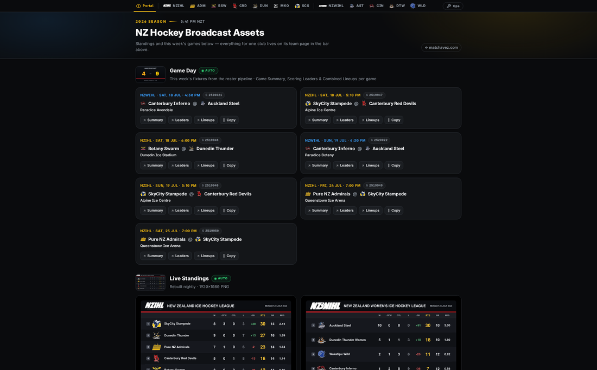

# NZ Hockey Broadcast Assets

The live portal and every on-air overlay for the NZIHL and NZWIHL broadcasts — one repo, published free at **[matchavez.com/hockey](https://matchavez.com/hockey/)**.

## What's here

This repo is the home base for running an NZIHL/NZWIHL broadcast: a portal linking everything, a set of live scoreboard/banner/stat overlays that plug straight into OBS/vMix/YoloBox as browser sources, and a few behind-the-scenes tools that help a producer check everything's working before and during a game.

**The Portal** ([`/hockey/`](https://matchavez.com/hockey/)) — the front door. Live standings, this weekend's games, and links to every club's page and every overlay below.

**Team & League pages** ([`/hockey/team/`](https://matchavez.com/hockey/team/?team=canterbury-red-devils), [`/hockey/league/`](https://matchavez.com/hockey/league/?league=nzihl)) — one page per club or league with that team's branding, standings, schedule, and every overlay link in one place.

**Live overlays** — self-updating graphics that read the live box score every few seconds and refresh on their own during a broadcast:

- **Scorebug + Live Banner** ([`/hockey/scorebug-l3/`](https://matchavez.com/hockey/scorebug-l3/)) — scoreboard plus an automatic goal/penalty banner
- **Activity Banner** ([`/hockey/activity-banner/`](https://matchavez.com/hockey/activity-banner/)) — the same banner as a transparent layer, no scoreboard
- **Ticker** ([`/hockey/ticker/`](https://matchavez.com/hockey/ticker/)) — scoreboard plus a scrolling play-by-play ticker
- **Live Game Summary** ([`/hockey/summary/`](https://matchavez.com/hockey/summary/)) — a full digital box score
- **Team Scoring Leaders** ([`/hockey/scoringleaders/`](https://matchavez.com/hockey/scoringleaders/)) — each team's top scorers, live
- **Starting Lineup** ([`/hockey/startinglineup/`](https://matchavez.com/hockey/startinglineup/)) & **Combined Starting Lineups** ([`/hockey/startinglineup/combined/`](https://matchavez.com/hockey/startinglineup/combined/)) — tonight's six, set from a director's control page
- **Player Lower Thirds** ([`/hockey/lowerthirds/`](https://matchavez.com/hockey/lowerthirds/)) — a phone page to put a player's stats on screen with one tap

**Producer tools** (not on-air graphics — dashboards for the person running the show):

- **Pre-Flight** ([`/hockey/preflight/`](https://matchavez.com/hockey/preflight/)) — a game-day health check: is the data feed up, is every team's game wired up correctly
- **Graphics QA** ([`/hockey/graphicstests/`](https://matchavez.com/hockey/graphicstests/)) — actually renders every overlay for every club and checks nothing's broken
- **Warehouse** ([`/hockey/warehouse/`](https://matchavez.com/hockey/warehouse/)) — browse the full season's games and every player/coach photo on file

Every page is a single self-contained HTML file — no build step, no dependencies beyond this repo's own fonts and a small shared Cloudflare Worker that proxies the league's live data.

## For a fuller visual tour

A screenshot-by-screenshot inventory of this project alongside the rest of the broadcast asset estate (standings graphics, roster PDFs, brand guide, etc., which live in sibling repos) is kept in Mat's project files as **"Hockey Assets Inventory."**

## Maintaining this project

Technical details — the full page-by-page reference (URL parameters, data contracts), every scraping gotcha, shared infrastructure, and the running history of decisions and fixes — live in **[`memory.md`](memory.md)**. Start there for anything beyond a quick look around.
